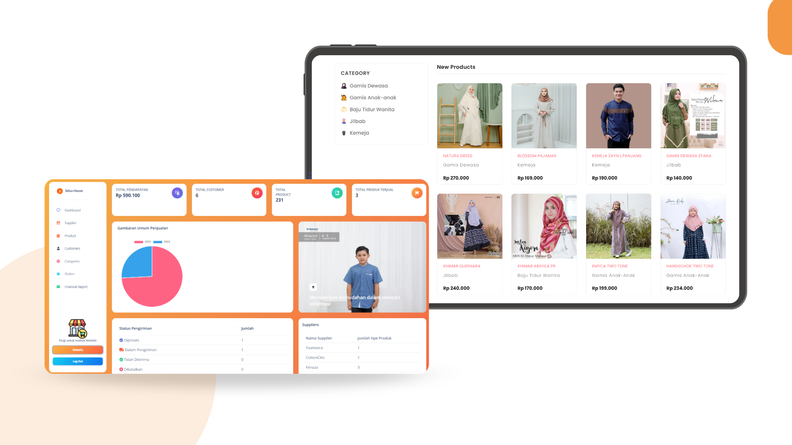
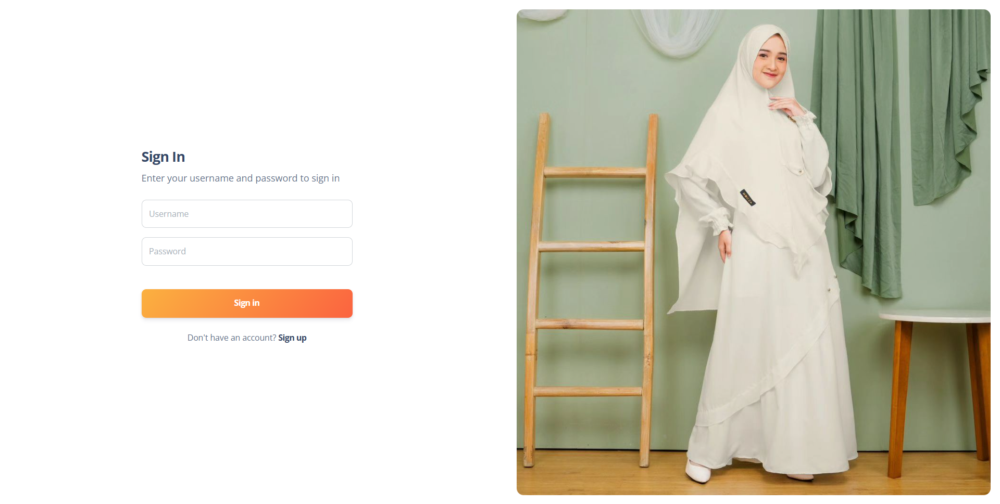
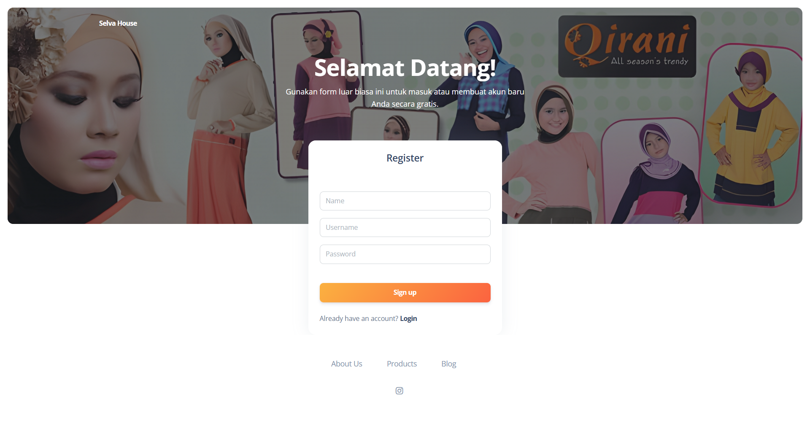
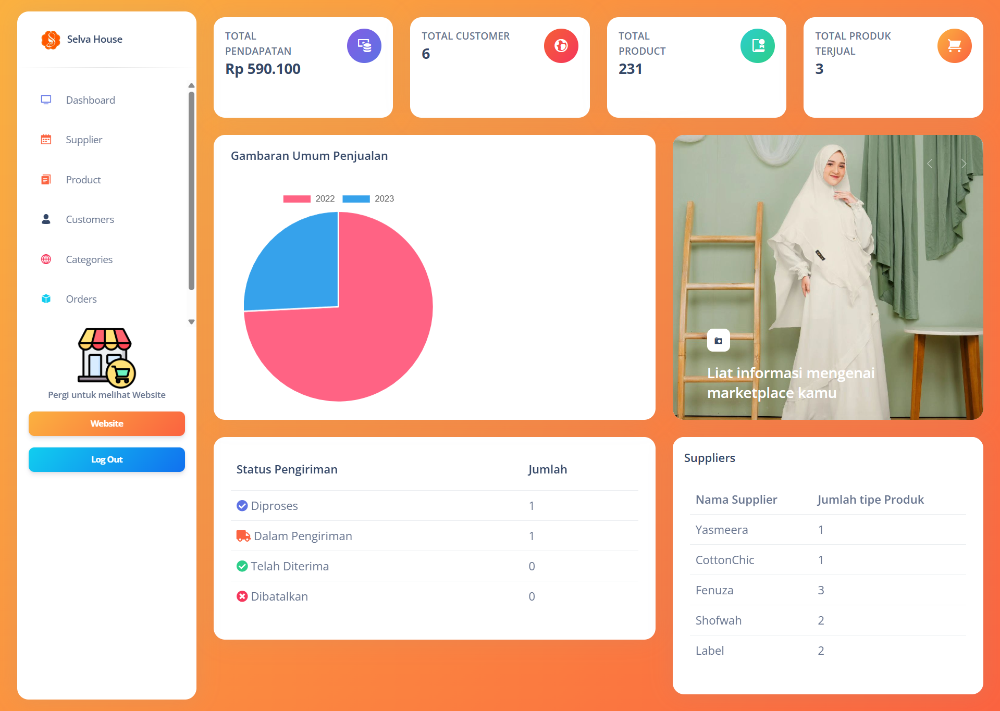
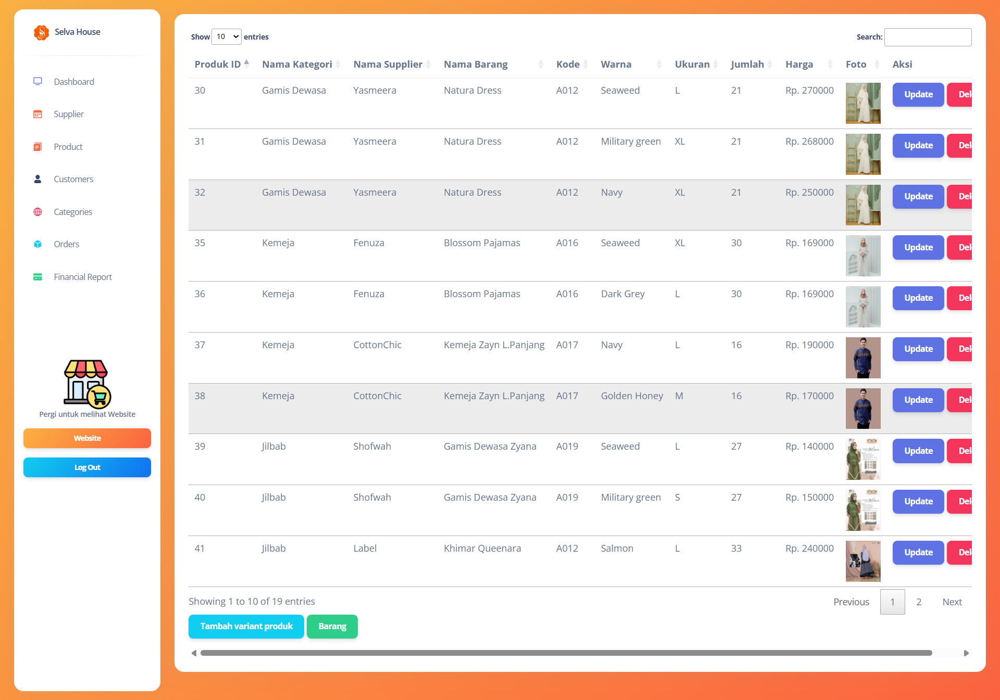
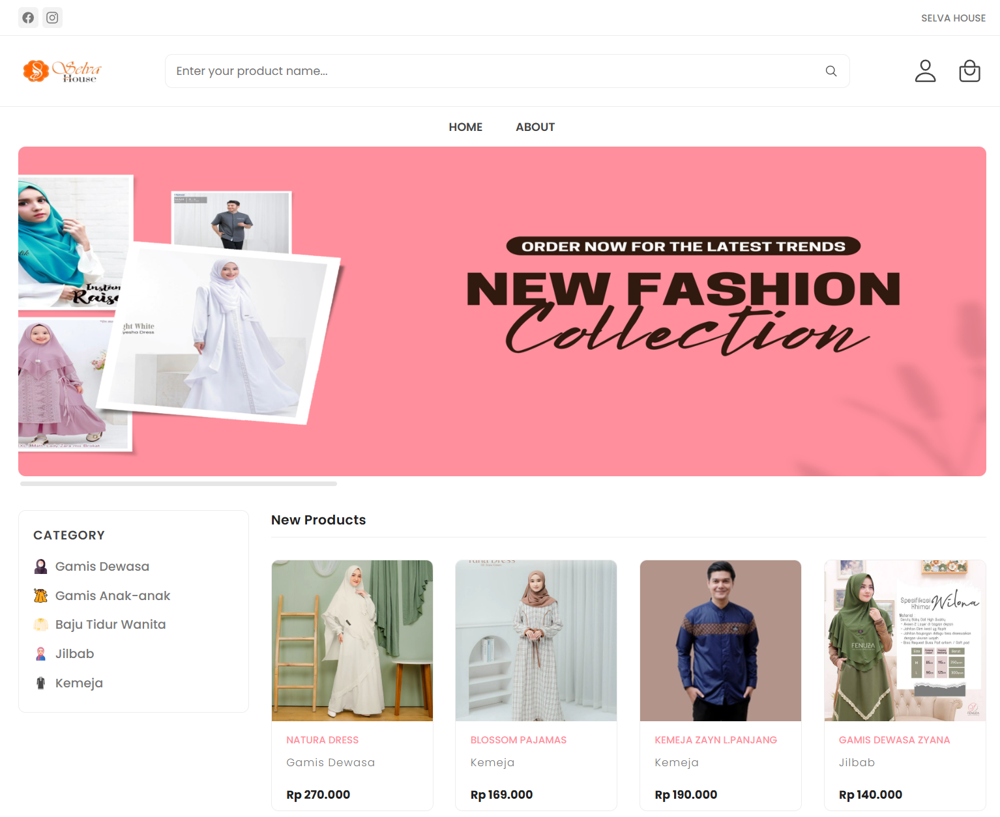
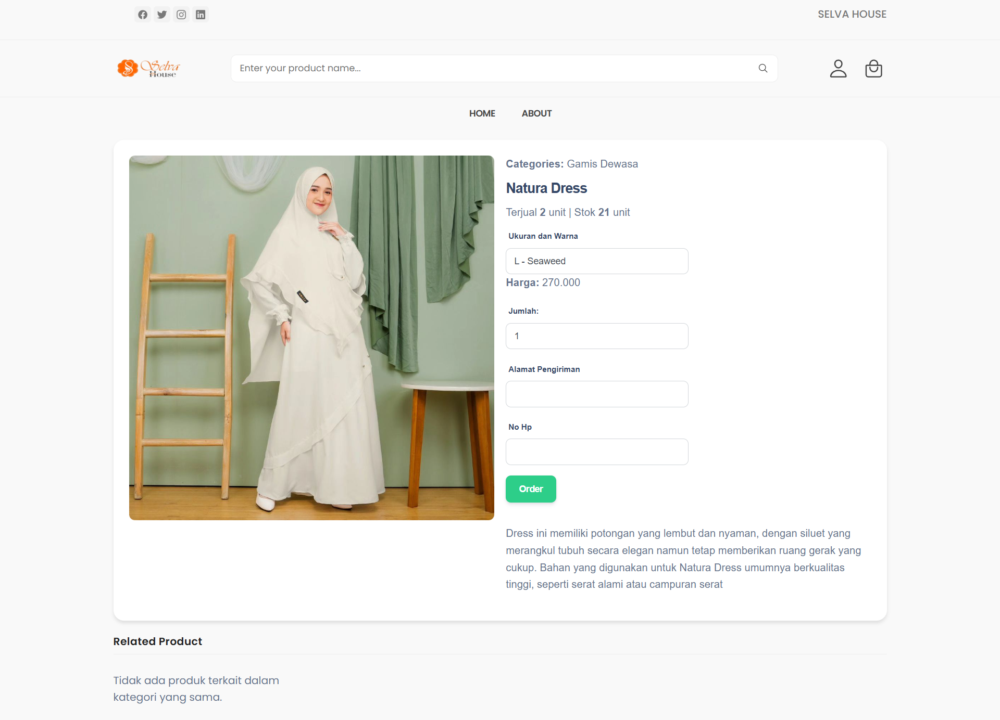

<h1 align="center">Selva House E-commerce</h1>
<p align="center">A simple E-commerce website that utilizes PHP as a backend and css with a little bootsrap seasoning for styling, suitable for those who want to learn simple PHP.</h1>

## ⚙️ Installation & Usage

Follow these steps to set up and run Selva House E-commerce on your local machine.

### Prerequisites

* **XAMPP**
* **Git**

### Step-by-Step Guide

1.  **Clone the Repository:**
    Start by cloning the project to your local machine using Git.
    ```bash
    git clone https://github.com/rrfito/Selva-House-E-Commerce.git
    cd SelvaHouseE-commerce
    ```
2.  **Move to XAMPP:**
    Copy the entire `SelvaHouseE-commerce` folder into your web server's document root (e.g., `C:\xampp\htdocs\` for XAMPP users).
3.  **Database Setup:**
    * Open your web browser and go to `http://localhost/phpmyadmin`.
    * Create a new database named `database`.
    * Import the `database.sql` file (located in your project root) into the newly created database.
4.  **Configure Database Connection:**
    * Navigate to `controller/koneksi.php` (or similar path depending on your project structure) within your project folder.
    * if you want to update the database credentials (username, password, database name) to match your local MySQL setup.
5.  **Run the Application:**
    * Start your Apache and MySQL modules in XAMPP.
    * Open your web browser and go to `http://localhost/Selva-House-E-Commerce/halaman/Login.php` to access the website.

## 📸 Feature Gallery

### Login


### Register


### Admin Panel



### Dashboard Customer


### Order Page


### Order history

